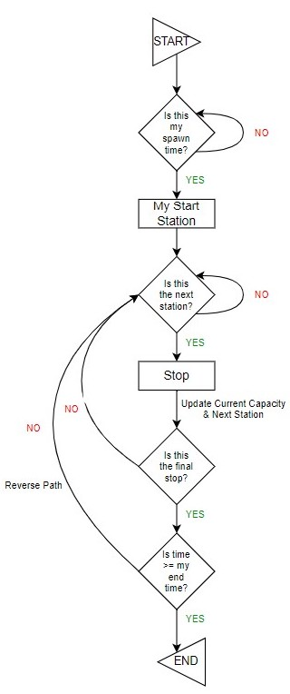
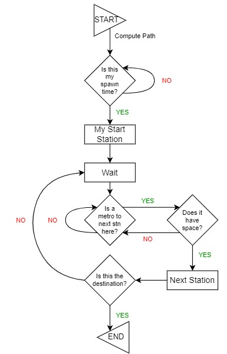
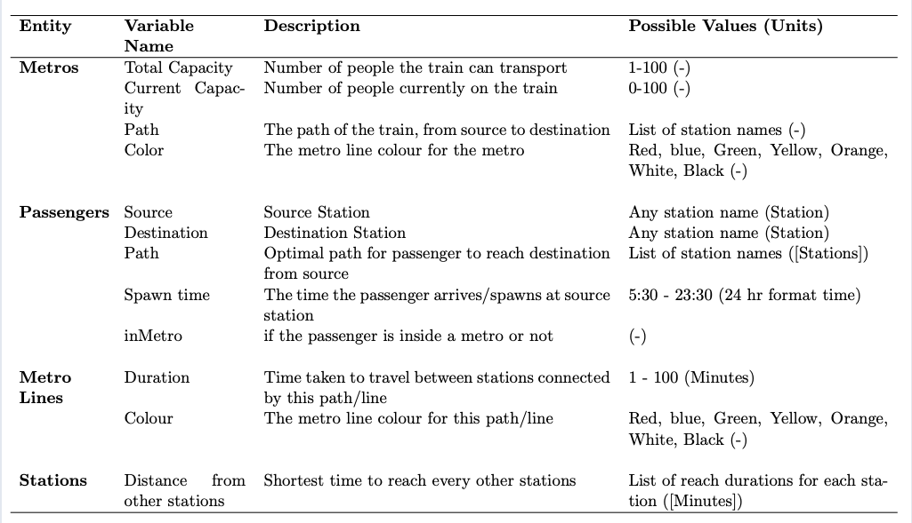

# Metro-Simulation
# Project: Metropolitan City Metro Simulation
Designed as part of the ABMS course by Group 7

| NAME | ROLL NO |
|------|---------|
|S Suryavardan| S20190010154 |
|Shreyash Mishra| S20190010120 |
|Shreyas MS| S20190010161 |
|Yaduraj Deshmukh| S20190010194 |

## Introduction
The project aims to simluate, assess and evaluate metro networks in metropolitan cities by presenting statistics such as congestion, wait time etc. The input data to the simulation model is the metro architecture of the city, passengers (with src and dest station), metro speed and metro frequency. By computing the shortest path for each passenger we are able to find the number of passengers using the metro at a given station and time period, subsequently depicting the wait time, congestion for each metro line and travel time.

## Video Demo

The presentation used in the video has been added to the repository.

## Sim Model details

